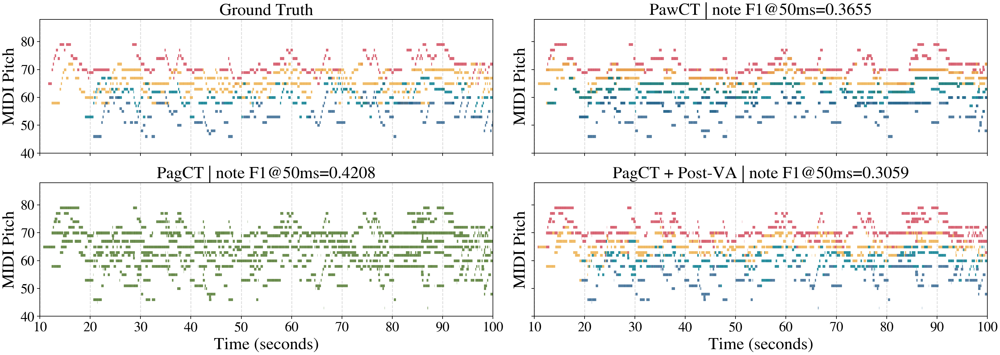

# PawCT: Part-Aware Choral Transcription

Research code for **“Toward Part-Aware Choral Transcription with Singing
Voice Assignment.”** PawCT transcribes a mixed choral recording into
note-level soprano, alto, tenor, and bass (SATB) parts. This repository also
contains the part-agnostic transcriber (PagCT) and a two-stage symbolic voice
assignment baseline (Post-VA).

> **Release status — audited research snapshot.** The core methods and the
> script used for the manuscript's qualitative figure are present. The exact
> training manifests, frozen configurations, checkpoints, and a one-command
> Table 1/2 reproduction are not yet available. Paper numbers below are
> reported results, not results regenerated from this commit. See
> [Reproducibility status](docs/REPRODUCIBILITY.md) before citing numerical
> claims.

[Online demo](https://hanyu-meng.github.io/ICASSP2027_Paw_Choral_AMT_Demo/) ·
[Code walkthrough](docs/CODE_WALKTHROUGH.md) ·
[Data contract](docs/DATA.md) ·
[Reproducibility audit](docs/REPRODUCIBILITY.md) ·
[YouChorale target audit](repro/audits/youchorale_targets_20260907_abe2438/README.md) ·
[ICASSP experiment plan](docs/EXPERIMENT_PLAN.md)

## What is implemented

| System | Input → output | Main implementation |
| --- | --- | --- |
| **PagCT** | mixed audio → merged note events | `src/models.py::PagCT` |
| **PawCT** | mixed audio → SATB note events | `src/models.py::PawCT` |
| **PawCT-RP / PawCT-OC** | PawCT with anchored range/continuity priors | `src/choral_targets.py::ChoralTargetBuilder` |
| **Post-VA** | merged note sequence → SATB labels | `src/train_midi_voice_assignment.py::SymbolicVoiceAssignmentNet` |

PawCT uses one shared CRNN encoder, four voice-specific onset/frame/offset
heads, an auxiliary segment-level part-presence head, and a max-over-parts union output.
The training objective combines per-part losses with union and presence losses.
RP and OC keep trusted S/A/T/B (including divisi such as S1/S2) labels and infer
only ambiguous labels; optional range and continuity losses regularize the
voice heads. They are not extra inference modules. Explicit `legacy_*` target
modes reproduce the earlier all-note relabeling for audit purposes only.



The figure is a precomputed author-generated visualization for the manuscript
example “Exsultate Deo” (`jd2_r4PK5dc`). It is included to verify code/figure
provenance; the underlying YouChorale audio and annotations are not
redistributed.

## Paper-reported results

The manuscript reports the following headline numbers on its YouChorale test
split:

| System | Part-agnostic note F1 @ 50 ms |
| --- | ---: |
| Yu et al. (2024) | 0.237 |
| PagCT without transposition augmentation | 0.333 |
| **PagCT** | **0.382** |

| System | Average SATB frame F1 | Average SATB note F1 @ 50 ms | Note retention ratio |
| --- | ---: | ---: | ---: |
| PawCT without union loss | 0.379 | 0.190 | 49.74% |
| PawCT | 0.458 | 0.217 | 56.81% |
| PawCT-RP | 0.510 | 0.209 | 54.71% |
| **PawCT-OC** | 0.503 | **0.225** | **58.90%** |
| PagCT + Post-VA | 0.489 | 0.175 | 45.81% |

These are historical manuscript values, not corrected results. The audit found
that the historical RP/OC frame scores used method-specific pseudo-target rolls
while note scores used original part labels, so frame values across those rows
are not directly comparable. The evaluator now rebuilds every SATB reference
from immutable part-name annotations; the table must be regenerated.

We call the manuscript's “VA Rate” a **note retention ratio** here because its
denominator comes from a separate part-agnostic system; it should not be read
as a pure voice-classification accuracy. Machine-readable transcriptions of
the reported tables are in [`repro/expected`](repro/expected).

## Repository layout

```text
src/          core acoustic, Post-VA, inference, and evaluation code
tools/        paper-style visualization utilities
experiments/  symbolic editor and VA2 prototypes not reported in the paper
tests/        existing unit tests plus release checks
repro/        reported values and the reproduction contract
docs/         static project/demo page and technical documentation
checkpoints/  artifact manifest only; model files are not committed
```

The modules intentionally remain flat to preserve the audited research code's
import behavior. Run commands from the repository root with `src`, `tools`, and
`experiments` on `PYTHONPATH`.

## Installation

Python 3.11 was used in the audited lab environment. Create an isolated
environment, install the PyTorch build appropriate for your CUDA runtime, and
then install the remaining pinned dependencies:

```bash
conda create -n pawct python=3.11 -y
conda activate pawct

# Choose the correct command for your platform at pytorch.org first.
pip install torch==2.10.0 torchaudio==2.10.0
pip install -r requirements-dev.txt

export PYTHONPATH="$PWD/src:$PWD/tools:$PWD/experiments${PYTHONPATH:+:$PYTHONPATH}"
```

The original lab environment used PyTorch 2.10.0 with CUDA 12.8 on an RTX
5090. A CPU install is sufficient for syntax/unit checks but not representative
of training throughput.

## Data

Data are intentionally excluded. Point Hydra at a local, legally obtained
dataset directory:

```bash
export YOUCHORALE_DIR=/absolute/path/to/YouChorale
```

The expected YouChorale layout is:

```text
$YOUCHORALE_DIR/
├── train.json
├── valid.json
├── test.json
├── audio/
│   └── <recording-id>.(wav|mp3|flac|m4a)
├── midi/
│   └── <recording-id>.(mid|midi)
└── note/
    └── <recording-id>.pkl
```

The packer uses the literal `audio/` and `midi/` directory names and pairs
files by recording ID. SATB label pickles are required for corrected choral
PagCT and PawCT runs: missing labels now fail fast instead of being silently
treated as empty targets. See
[docs/DATA.md](docs/DATA.md) for the annotation schema, split requirements,
and redistribution policy.

## Prepare HDF5 features

Packing writes to `exp.workspace/hdf5s/...`; this generated directory is
ignored by Git.

```bash
python src/data_generator.py pack_youchorale_dataset_to_hdf5 \
  dataset.youchorale_dir="$YOUCHORALE_DIR" \
  exp.workspace=./workspaces \
  feature.sample_rate=16000
```

Before training, audit composition overlap and label the protocol accurately.
The official YouChorale recording split is not composition-disjoint; retain it
for prior-work comparison and create a separately named grouped split for the
generalization experiment. Each protocol needs its own training, validation
selection, locked test pass, and committed manifests; see the exact proposed
rule in [the experiment plan](docs/EXPERIMENT_PLAN.md).

Audit target semantics before choosing RP/OC hyperparameters:

```bash
python tools/audit_choral_targets.py \
  --dataset-dir "$YOUCHORALE_DIR" \
  --split train \
  --output-json ./workspaces/audits/youchorale_train_targets.json
```

The report is CPU-only and read-only with respect to the dataset. It records
known/unknown labels, divisi and greater-than-four-note onset groups, modern
versus legacy RP/OC label changes, confusion matrices, split hashes, and
per-voice pitch percentiles. Estimate any RP range from training-only robust
percentiles (for example p01–p99), then freeze it before validation/test.

The checked-in audit covers 452 recordings and 353,201 in-range notes. All
notes have a canonical SATB/divisi-derived label, so anchored RP and OC change
zero labels; legacy RP changes 0.57% and legacy OC changes 15.37%. This proves
that RP/OC cannot be evaluated here merely as alternative hard target builders:
their modern effect must come from soft output regularization. The train-only
p01/p99 ranges are S `60–79`, A `55–74`, T `50–69`, and B `41–62`; the formal
P2/P3 pilots freeze these values with a two-semitone margin. Full split-level
counts, checksums, and interpretation are in the
[versioned audit](repro/audits/youchorale_targets_20260907_abe2438/README.md).

## Train

Commands below show the development seed 86. After validation-only pilot
selection, rerun each frozen main configuration with seeds 17, 42, and 86.
The fixed pilot grid, constraints, tie-breaks, and statistical estimand are in
[docs/EXPERIMENT_PLAN.md](docs/EXPERIMENT_PLAN.md).

### PagCT

```bash
python src/main_iter.py \
  dataset.train_set=youchorale \
  dataset.test_set=youchorale \
  dataset.youchorale_dir="$YOUCHORALE_DIR" \
  model.arch=pagct \
  model.mode=frame_onset_offset \
  choral.enable=false \
  exp.random_seed=86 exp.name_suffix=pagct_s86 \
  exp.workspace=./workspaces \
  exp.total_iteration=200000 \
  exp.selection_metric=frame_ap \
  exp.early_stopping_patience_evals=8 \
  exp.batch_size=8
```

### PawCT controls

Run the same part-name baseline once without union supervision (P1a) and once
with the fixed union weight (P1b). The explicit suffixes keep their checkpoint
directories separate:

```bash
# P1a: part-aware heads without union supervision.
python src/main_iter.py \
  dataset.train_set=youchorale dataset.test_set=youchorale \
  dataset.youchorale_dir="$YOUCHORALE_DIR" \
  model.arch=pawct model.mode=frame_onset_offset \
  choral.enable=true choral.target_assignment=part_name \
  choral.apply_presence_gate=false \
  choral.union_frame_loss_weight=0.0 \
  choral.union_onset_loss_weight=0.0 \
  choral.union_offset_loss_weight=0.0 \
  feature.max_note_shift=0 \
  exp.random_seed=86 exp.name_suffix=no_union_s86 \
  exp.workspace=./workspaces exp.total_iteration=200000 \
  exp.selection_metric=mean_voice_frame_ap \
  exp.early_stopping_patience_evals=8 exp.batch_size=8

# P1b: core PawCT with union supervision and no RP/OC prior.
python src/main_iter.py \
  dataset.train_set=youchorale dataset.test_set=youchorale \
  dataset.youchorale_dir="$YOUCHORALE_DIR" \
  model.arch=pawct model.mode=frame_onset_offset \
  choral.enable=true choral.target_assignment=part_name \
  choral.apply_presence_gate=false \
  choral.union_frame_loss_weight=0.25 \
  choral.union_onset_loss_weight=0.25 \
  choral.union_offset_loss_weight=0.0 \
  feature.max_note_shift=0 \
  exp.random_seed=86 exp.name_suffix=union_u025_s86 \
  exp.workspace=./workspaces exp.total_iteration=200000 \
  exp.selection_metric=mean_voice_frame_ap \
  exp.early_stopping_patience_evals=8 exp.batch_size=8
```

### P2: PawCT-RP

```bash
python src/main_iter.py \
  dataset.train_set=youchorale \
  dataset.test_set=youchorale \
  dataset.youchorale_dir="$YOUCHORALE_DIR" \
  model.arch=pawct \
  model.mode=frame_onset_offset \
  choral.enable=true \
  choral.target_assignment=range_prior \
  choral.preserve_known_part_labels=true \
  choral.voice_assignment_range_mins='[60,55,50,41]' \
  choral.voice_assignment_range_maxs='[79,74,69,62]' \
  choral.voice_assignment_range_margin=2.0 \
  choral.range_prior_loss_weight=0.01 \
  choral.continuity_prior_loss_weight=0.0 \
  choral.apply_presence_gate=false \
  choral.union_frame_loss_weight=0.25 \
  choral.union_onset_loss_weight=0.25 \
  choral.union_offset_loss_weight=0.0 \
  feature.max_note_shift=0 \
  exp.random_seed=86 exp.name_suffix=rp_trainp01p99_m2_rw001_u025_s86 \
  exp.workspace=./workspaces \
  exp.total_iteration=200000 \
  exp.selection_metric=mean_voice_frame_ap \
  exp.early_stopping_patience_evals=8 \
  exp.batch_size=8
```

### P3: PawCT-RP+OC

```bash
python src/main_iter.py \
  dataset.train_set=youchorale \
  dataset.test_set=youchorale \
  dataset.youchorale_dir="$YOUCHORALE_DIR" \
  model.arch=pawct \
  model.mode=frame_onset_offset \
  choral.enable=true \
  choral.target_assignment=ordered_continuity \
  choral.preserve_known_part_labels=true \
  choral.voice_assignment_range_mins='[60,55,50,41]' \
  choral.voice_assignment_range_maxs='[79,74,69,62]' \
  choral.voice_assignment_range_margin=2.0 \
  choral.range_prior_loss_weight=0.01 \
  choral.continuity_prior_loss_weight=0.01 \
  choral.apply_presence_gate=false \
  choral.union_frame_loss_weight=0.25 \
  choral.union_onset_loss_weight=0.25 \
  choral.union_offset_loss_weight=0.0 \
  feature.max_note_shift=0 \
  exp.random_seed=86 exp.name_suffix=rpoc_trainp01p99_m2_rw001_cw001_u025_s86 \
  exp.workspace=./workspaces \
  exp.total_iteration=200000 \
  exp.selection_metric=mean_voice_frame_ap \
  exp.early_stopping_patience_evals=8 \
  exp.batch_size=8
```

`feature.max_note_shift` must remain zero for choral dataset loaders in this
snapshot: the older online path shifted the mixture but not the `note.pkl`
targets. Use only a synchronously generated offline transposition dataset
until that path has an end-to-end test.

Because all 299,638 audited YouChorale training notes have canonical labels,
`target_assignment=range_prior` and `ordered_continuity` each change exactly
zero modern targets. The explicit output-prior loss is therefore what
distinguishes the pilots above; trusted labels remain anchored. RP suppresses
unsupported output mass outside the frozen train-only range and never penalizes
an annotated positive. The OC row keeps the RP range and weight fixed and adds
only the continuity loss, so its comparison with RP isolates the incremental
OC hypothesis. The corrected OC loss matches predicted pitch motion
to annotated pitch motion between consecutive onset events, including events
separated by rests. Gap decay weakens distant links, while event-level
normalization prevents long held notes from diluting the transition signal;
the gap is measured from frame activity, not merely from inter-onset time.
Unlike the historical zero-motion penalty, it does not punish a correctly
predicted melodic leap. These `0.01`
weights are starting points, not validated best hyperparameters. Give every
`row × hyperparameter setting × seed` a unique `exp.name_suffix`, freeze the
winner on validation, and only then start a full run. Propagate that suffix
through inference, threshold search, and scoring so seeds cannot overwrite one
another. New training saves `best.pth`
using complete, deterministic validation `mean_voice_frame_ap` and supports
metric-based early stopping. This threshold-free frame metric is a fixed
checkpoint-selection proxy, not the paper's primary endpoint; the latter is
macro SATB note F1 after validation-only decoder selection. Use the same proxy
for every PawCT row. A short pilot may explicitly
set `exp.max_eval_batches=20`, but a paper run must leave it `null`. The located historical runs continued
to 300k steps, whereas the manuscript states 200k with validation-loss early
stopping; regenerated results must use and record one consistent rule.

The recommended union objective supervises frame and onset only. Taking the
maximum of four voice-offset heads fires when *any* same-pitch part releases,
which is not necessarily the end of the audible union; supervising it against
a canonical union offset would conflict with correct per-part offsets. Keep
`choral.union_offset_loss_weight=0.0` until an independent union-offset head or
an overlap-aware supervision mask is evaluated.

For every choral dataset, both PagCT and PawCT now obtain their global targets
and note-level references from the complete `note/<recording>.pkl` intervals.
The canonical projector merges only same-pitch attacks that land on the same
model frame and preserves later attacks as rearticulations. It does not use the
50/100 ms scoring tolerance. This fixes three coupled historical errors: a
merged-MIDI pitch key could overwrite cross-voice unisons, finite MIDI-event
backtracking could miss long notes, and one shared boundary mask could hide
known frame/onset labels. Existing HDF5 packs can still supply audio, but all
corrected table rows must be retrained and re-inferred; the manuscript's old
`0.225` OC value is historical evidence, not a corrected result.

Historical configurations that use `model.arch=hpt` remain supported solely
for loading and reproducing old checkpoints. New runs should use the explicit
`pagct` or `pawct` architecture names shown above. Unversioned historical
PawCT checkpoints require `choral.apply_presence_gate=true`, matching the old
forward pass, and `exp.allow_unknown_checkpoint_target_assignment=true`
because their RP/OC training semantics cannot be proven. They also require
`exp.allow_legacy_checkpoint_model_identity=true` because the old files did
not record the pitch coordinate or audio-frontend identity. New schema-v2
checkpoints are loaded with PyTorch's restricted `weights_only=True` path. If a
trusted pre-v2 file contains historical NumPy/Python pickle objects and the
restricted loader rejects it, loading additionally requires the independent
`exp.allow_unsafe_legacy_checkpoint_load=true` opt-in. That switch permits
arbitrary-code-capable pickle deserialization, never applies to schema-v2
files, and is not implied by any behavior/key mismatch flag. Such a run is a
historical diagnostic, not a new formal result. The loader rejects silent
target or gate changes unless the run explicitly records a weight-reuse
ablation.

## Validation thresholds, then locked test

Inference and scoring now keep validation and test probabilities in separate
directories. Threshold search defaults to validation and refuses test tuning
unless a user explicitly marks it as a non-reportable diagnostic.
Each new probability file also records the actual checkpoint iteration and
checkpoint SHA-256, model/input identity, inference-run ID, target semantics,
and the HDF5/SATB-reference content hashes. Formal choral scoring requires
every recording in the packed split exactly once and refuses missing, changed,
stale, mixed-checkpoint, or mismatched-provenance artifacts. This is especially
important for `best.pth`:
an interrupted re-inference cannot silently combine outputs from two different
versions of the best checkpoint.

```bash
# Use the exact suffix from the selected training run in every later command.
export PAWCT_RUN_SUFFIX=rpoc_trainp01p99_m2_rw001_cw001_u025_s86

# 1. Produce validation probabilities.
python src/inference.py \
  dataset.test_set=youchorale \
  dataset.eval_split=validation \
  dataset.youchorale_dir="$YOUCHORALE_DIR" \
  model.arch=pawct \
  model.mode=frame_onset_offset \
  choral.enable=true \
  choral.target_assignment=ordered_continuity \
  choral.voice_assignment_range_mins='[60,55,50,41]' \
  choral.voice_assignment_range_maxs='[79,74,69,62]' \
  choral.voice_assignment_range_margin=2.0 \
  choral.range_prior_loss_weight=0.01 \
  choral.continuity_prior_loss_weight=0.01 \
  choral.evaluation_reference_assignment=part_name \
  post.post_processor_type=onsets_frames \
  exp.name_suffix="$PAWCT_RUN_SUFFIX" \
  exp.workspace=./workspaces \
  exp.ckpt_iteration=best

# 2. Select thresholds on validation only.
python src/search_best_thresholds.py \
  --config_dir src \
  --workspace ./workspaces \
  --test_set youchorale \
  --split validation \
  --youchorale-dir "$YOUCHORALE_DIR" \
  --ckpt_iteration best \
  --choral_enable \
  --choral_per_voice \
  --target-assignment ordered_continuity \
  --model_mode frame_onset_offset \
  --range-prior-loss-weight 0.01 \
  --continuity-prior-loss-weight 0.01 \
  --name_suffix "$PAWCT_RUN_SUFFIX" \
  --objective mean_satb_note_f1 \
  --post_processor_type onsets_frames \
  --config-override 'choral.voice_assignment_range_mins=[60,55,50,41]' \
  --config-override 'choral.voice_assignment_range_maxs=[79,74,69,62]' \
  --config-override 'choral.voice_assignment_range_margin=2.0' \
  --output_txt ./workspaces/thresholds/pawct_oc_validation.txt

# Repeat --config-override for any checkpoint-recorded setting without a
# dedicated flag. These three overrides must match the selected checkpoint.

# 3. Copy the selected thresholds and actual_checkpoint_iteration from the
#    threshold report into a frozen config. Use that immutable numeric
#    checkpoint—not the mutable `best` alias—for the one test pass.
export PAWCT_ITERATION=15000  # replace with actual_checkpoint_iteration
python src/inference.py \
  dataset.test_set=youchorale \
  dataset.eval_split=test \
  dataset.youchorale_dir="$YOUCHORALE_DIR" \
  model.arch=pawct \
  model.mode=frame_onset_offset \
  choral.enable=true \
  choral.target_assignment=ordered_continuity \
  choral.voice_assignment_range_mins='[60,55,50,41]' \
  choral.voice_assignment_range_maxs='[79,74,69,62]' \
  choral.voice_assignment_range_margin=2.0 \
  choral.range_prior_loss_weight=0.01 \
  choral.continuity_prior_loss_weight=0.01 \
  choral.evaluation_reference_assignment=part_name \
  post.post_processor_type=onsets_frames \
  exp.name_suffix="$PAWCT_RUN_SUFFIX" \
  exp.workspace=./workspaces \
  exp.ckpt_iteration="$PAWCT_ITERATION" \
  choral.use_per_voice_thresholds=true \
  choral.voice_frame_thresholds='[...]' \
  choral.voice_onset_thresholds='[...]' \
  choral.voice_offset_thresholds='[...]'

python src/calculate_choral_scores.py \
  dataset.test_set=youchorale \
  dataset.eval_split=test \
  dataset.youchorale_dir="$YOUCHORALE_DIR" \
  model.arch=pawct \
  model.mode=frame_onset_offset \
  choral.enable=true \
  choral.target_assignment=ordered_continuity \
  choral.voice_assignment_range_mins='[60,55,50,41]' \
  choral.voice_assignment_range_maxs='[79,74,69,62]' \
  choral.voice_assignment_range_margin=2.0 \
  choral.range_prior_loss_weight=0.01 \
  choral.continuity_prior_loss_weight=0.01 \
  choral.evaluation_reference_assignment=part_name \
  post.post_processor_type=onsets_frames \
  exp.name_suffix="$PAWCT_RUN_SUFFIX" \
  exp.workspace=./workspaces \
  exp.ckpt_iteration="$PAWCT_ITERATION" \
  choral.use_per_voice_thresholds=true \
  choral.voice_frame_thresholds='[...]' \
  choral.voice_onset_thresholds='[...]' \
  choral.voice_offset_thresholds='[...]'
```

Pre-release probability files without provenance can be inspected only as a
clearly labelled historical diagnostic by adding
`exp.require_probability_provenance=false`. They are not valid inputs to a new
paper result, and the complete split manifest is still enforced.

## P4: Post-VA (exploratory until feature parity is fixed)

Train the symbolic note classifier from ground-truth note sequences:

```bash
python src/train_midi_voice_assignment.py \
  --dataset-dir "$YOUCHORALE_DIR" \
  --workspace ./workspaces \
  --experiment-name post_va \
  --learning-rate 1e-3 \
  --epochs 80 \
  --batch-size 32 \
  --seed 86
```

The historical checkpoint located during audit was actually trained with
AdamW at `1e-3`, for 80 epochs, with range and crossing regularizers. Its paper
configuration must therefore be reconciled before reporting a reproduced
Post-VA number. Predicted-MIDI evaluation no longer depends on an adjacent
YourMT3 checkout; it uses the declared `mido` dependency.

## Tests

```bash
python -m compileall -q src tools experiments tests
pytest -q
python scripts/check_release.py
```

The test suite includes data-free PawCT forward/union/loss-backward checks,
strict checkpoint compatibility, anchored RP/OC target retention, decoder
boundaries, deterministic validation sampling, threshold-split guards, metric
helpers, and visualization. A versioned real-data label/target audit is
[checked in](repro/audits/youchorale_targets_20260907_abe2438/README.md);
end-to-end model retraining, probability-integrity integration, and
table-regression tests remain release work and are tracked in
[docs/REPRODUCIBILITY.md](docs/REPRODUCIBILITY.md).

## Demo

`docs/` is a dependency-free GitHub Pages site. It presents the method,
reported tables, and an interactive view of the author-generated qualitative
figure. It deliberately does not offer browser inference or redistribute
YouChorale audio/MIDI. A future listening demo should use only recordings and
derived assets with explicit redistribution permission.

To preview locally:

```bash
python -m http.server 8000 --directory docs
```

Then open <http://localhost:8000>.

## Known limitations

- Exact checkpoints, commit/config hashes, split manifests, and table
  reproduction scripts are not yet released.
- PagCT and PawCT are not parameter-matched in this snapshot: the PagCT class
  has separate full frame/onset/offset acoustic branches, whereas PawCT uses a
  shared encoder.
- Regression-style post-processing is present, but the located loss supervises
  binary onset/offset rolls rather than the generated regression targets.
- Post-VA has a feature mismatch between ground-truth-note training and some
  predicted-note evaluation paths, where beat-related features are zero-filled.
- `ChoralAMTTranscriber.transcribe()` writes the merged union output; a stable
  public audio-to-four-track SATB MIDI CLI still needs to be extracted from the
  visualization helpers.
- Files in `experiments/` (symbolic editors, VA2 variants, and related ideas)
  are exploratory and were not reported in the manuscript.

## Security and artifact trust

Only load checkpoints and pickle files from sources you trust. Probability and
annotation pickle files, plus legacy PyTorch checkpoints loaded with the
explicit unsafe opt-in above, can execute code while loading. Schema-v2 model
checkpoints use the restricted weights-only loader and primitive RNG state.
Generated artifacts are ignored by default; a future checkpoint release must
include its exact config, source commit, dataset/split manifest, and SHA-256
checksum.

## Maintainer

Research code and release maintenance: [Hanyu Meng](https://github.com/Hanyu-Meng),
Multimodal Music Research Lab.

## License and attribution

Source code is released under Apache License 2.0. Portions are adapted from
ByteDance's
[High-resolution Piano Transcription](https://github.com/bytedance/piano_transcription)
codebase; see [NOTICE](NOTICE) and [THIRD_PARTY.md](THIRD_PARTY.md).
This source-code license does not grant rights to datasets, recordings,
annotations, checkpoints, or generated media.
